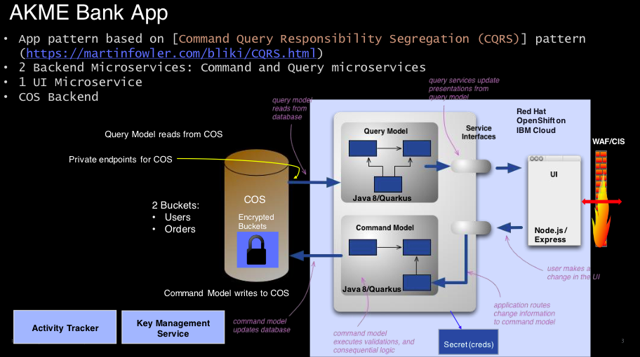

# Demo for Akme Bank with COS    
 
App based on [Command Query Responsibility Segregation (CQRS)](https://martinfowler.com/bliki/CQRS.html)
Using Java and Quarkus and COS Java SDK. 
 
## Deploying
  
Deploying the account-command-ms: 

```bash 
cd account-command-ms 
make deploy 
```

Deploying the account-query-ms:

```bash
cd account-query-ms
make deploy
```

## Loading customer data in COS

This is list of available commands:

```bash
accounts <command>

Commands:
  accounts create <n>                   create n users with 3 accounts each
  accounts create-named <first> <last>  create named user with 3 accounts
  accounts delete-users                 delete all users
  accounts delete-accounts              delete all accounts
  accounts list-users                   list all users
  accounts list-accounts                list all accounts
```
 
To create 10 random users with accounts, run:

```bash
kubectl run cli --rm -it --image us.icr.io/paolo/account-cli --restart=Never --quiet=true -- create 10
```

For the demo, create a named user with accounts as follow:

```bash
kubectl run cli --rm -it --image us.icr.io/paolo/account-cli --restart=Never --quiet=true -- create-named Jack Doe
```

To list users, run:

```bash
kubectl run cli --rm -it --image us.icr.io/paolo/account-cli --restart=Never --quiet=true -- list-users
```

To list accounts, run:

```bash
kubectl run cli --rm -it --image us.icr.io/paolo/account-cli --restart=Never --quiet=true -- list-accounts
```

To delete all users and accounts, run:

```bash
kubectl run cli --rm -it --image us.icr.io/paolo/account-cli --restart=Never --quiet=true -- delete-accounts
kubectl run cli --rm -it --image us.icr.io/paolo/account-cli --restart=Never --quiet=true -- delete-users
```

## AKME Terraform configuration for Cloud infrastructure. 



## DevSecOps CI and CD pipeline configuration

The COS configuration is required for the deployment stage in the DevSecOps CI or DevSecOps CD pipelines.
The values should be provided thru the following environment properties:

| Environment Property | Description | Default value |
|---|---|---|
| AKME_COS_API_KEY | API Key to acces the COS service | |
| AKME_COS_SERVICE_INSTANCE_ID | COS service instance id | |
| AKME_COS_ENDPOINT_URL | COS endpoint URL | s3.eu-de.cloud-object-storage.appdomain.cloud |
| AKME_COS_LOCATION | COS instance location | eu-de |
| AKME_COS_ACCOUNTS_BUCKET | COS Bucket nme for AKME accounts | akme-account-bucket |
| AKME_COS_USERS_BUCKET | COS Bucket name for AKME users | akme-users-bucket |

If SonarQube static scan is enabled (using `opt-in-sonar` feature flag), the sonarqube scanner command to use has to be given as it needs to use the maven sonar plugin

| Environment Property | Description | Value |
|---|---|---|
| sonarqube-scan-command | the command to use for sonarqube scan | `mvn -Dmaven.repo.local="${WORKSPACE}/.m2" -Dsonar.login="$(cat /tmp/sonarqube-token)" -Dsonar.host.url="$SONAR_HOST_URL" -Dsonar.projectKey="$SONAR_PROJECT_KEY" -Dsonar.projectName="$SONAR_PROJECT_KEY" -Dsonar.working.directory="$(realpath --relative-to=$(pwd) $SONAR_DIR)" sonar:sonar` |
